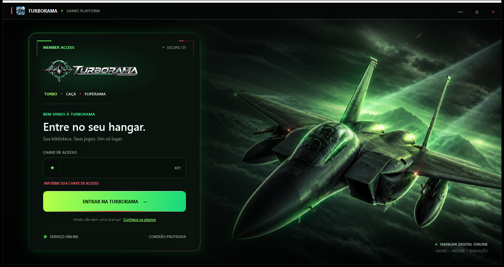

# TURBORAMA SUITE

Central desktop WPF para organizar sistemas retrô, catálogo, biblioteca e downloads com identidade visual Turborama.



## Versão 1.7.0

- Windows 10/11 x64;
- login e interface Turborama;
- 22 categorias e 850 itens identificados individualmente;
- 45 pôsteres retrô verticais 1024×1536 no padrão Turborama e capas específicas para os demais itens;
- carrossel retrô circular no estilo EmulationStation, com capa central ampliada, ação fina e navegação por setas, teclado, roda ou clique;
- 45 ícones de sistema ligados individualmente aos itens do carrossel;
- cards com a arte em destaque, fundo adaptativo para capas horizontais e brilho neon no mouse sem desfocar a imagem;
- busca sem diferenciação de acentos;
- quatro cards por página e paginação compacta;
- fila, progresso, pausa e retomada automática após queda de internet ou fechamento;
- extração automática de ZIP, RAR e 7z, com pacote preservado em caso de falha;
- pasta mestre persistente `Turborama Roms` para jogos, localizada automaticamente apenas em caminhos seguros conhecidos e relocalizada pelo usuário se houver ambiguidade ou se for movida;
- preservação de categoria/item dentro da pasta mestre e escolha de outro disco quando faltar espaço;
- verificação de tamanho e SHA-256 antes de concluir;
- publicação autocontida, sem exigir instalação separada do .NET.

O acesso ainda é demonstrativo: qualquer chave não vazia abre a interface. No catálogo público, os 850 botões baixam somente um arquivo Turborama de teste com 92 bytes e não exigem extração. URLs privadas são incluídas apenas pelo processo local de atualização; a validação de licença ainda deve ser conectada ao servidor Turborama.

## Download para teste

Baixe o pacote pronto em [Releases — Turborama 1.7.0](https://github.com/luziellacerda/TRUBORAMA-SUITE/releases/tag/v1.7.0) e confira o SHA-256 publicado junto ao executável.

As 850 capas completas, o fallback global e os 45 ícones de sistema acompanham o pacote. A pasta `Assets/Catalog/Images` contém exatamente 851 imagens; os 45 pacotes de Jogos retrô usam pôsteres lossless em 2:3.

## Compilar

Requisitos: Windows e .NET SDK 8.

```powershell
dotnet restore .\TurboBoxManager.csproj --source https://api.nuget.org/v3/index.json
dotnet build .\TurboBoxManager.csproj -c Release --no-restore
```

## Validar o catálogo

```powershell
dotnet run --project .\tests\CatalogVerifier\CatalogVerifier.csproj -c Release -- .\Assets\Catalog\catalog.json
```

O verificador confere as 22 categorias, 850 itens, os 45 pôsteres e 45 ícones retrô, busca, paginação, fallback visual, retomada HTTP, pausa, descarte explícito, falta de espaço e extração segura.

## Publicar

```powershell
dotnet restore .\TurboBoxManager.csproj -r win-x64 --source https://api.nuget.org/v3/index.json
dotnet publish .\TurboBoxManager.csproj -c Release -r win-x64 --self-contained true --no-restore -p:PublishSingleFile=true -p:IncludeNativeLibrariesForSelfExtract=true -p:PublishTrimmed=false -o .\publish
```

Mantenha `Assets/Catalog/catalog.json`, `Assets/Catalog/Images` e `Assets/Catalog/SystemIcons` junto ao executável publicado. Esses arquivos permanecem externos para permitir atualização posterior do catálogo.

## Segurança do pacote

O manifesto público não contém credenciais nem URLs privadas de download. Cada download permitido usa HTTPS, lista de hosts autorizados, arquivo parcial persistente, HTTP Range/If-Range, limite de tamanho, caminho canônico e verificação SHA-256 quando disponível. Pausar nunca apaga o parcial; somente a ação confirmada **Apagar pacote** faz isso. A extração valida todos os caminhos e usa uma área temporária antes de publicar os jogos na pasta mestre `Turborama Roms`.
